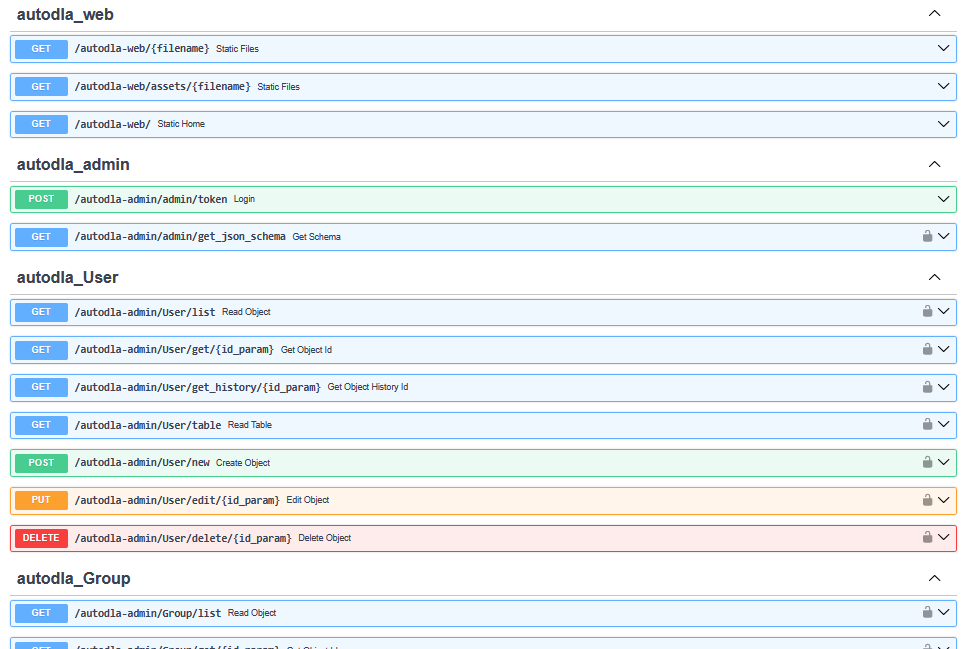
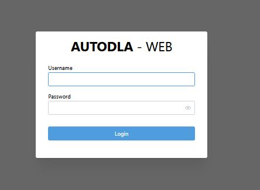
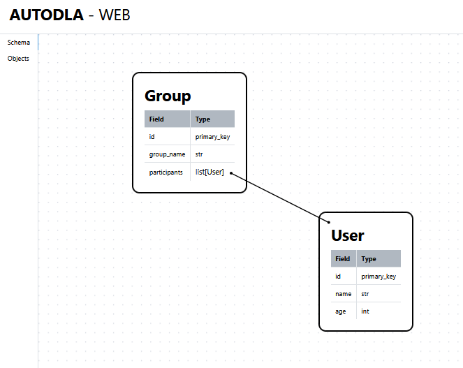
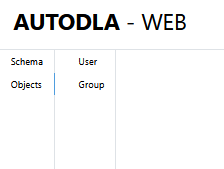
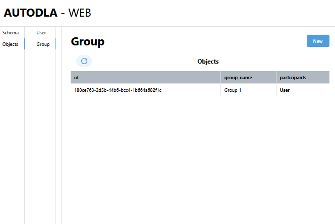
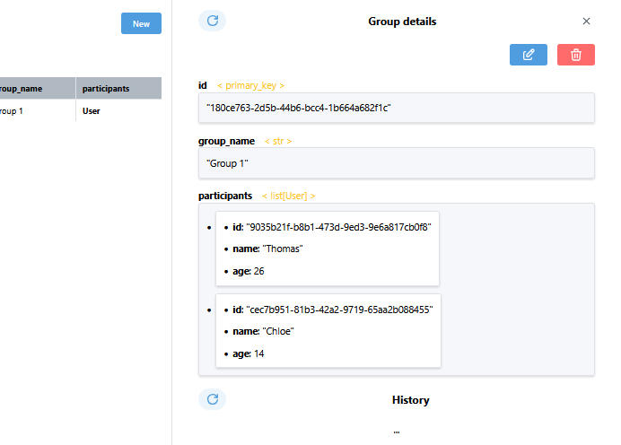
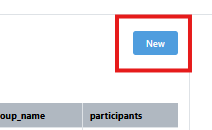
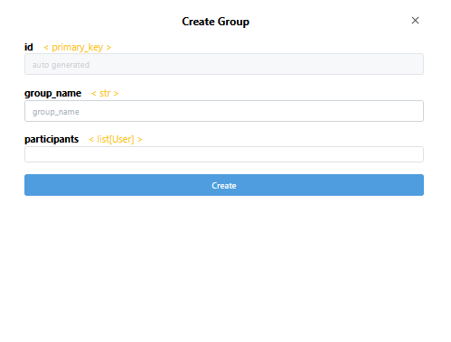
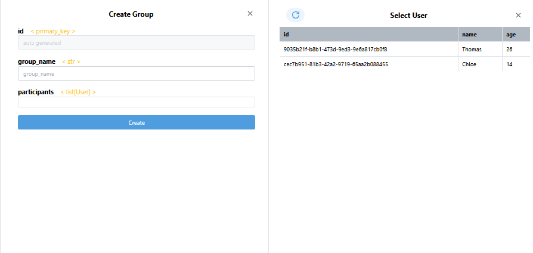

You can connect AutoDLA with the web framework of your choosing to automatically build AutoDLA WEB, a robust Data Admin Panel

## Setup
For this example we are going to use FastAPI
```bash
pip install autodla[fastapi] #install dependency
```

And the next schema:
```python
from autodla import Object, primary_key
from autodla.dbs import PostgresDB

class User(Object):
    id: primary_key = primary_key.auto_increment()
    name: str
    age: int

class Group(Object):
    id: primary_key = primary_key.auto_increment()
    group_name: str
    participants: list[User]

db = PostgresDB()
db.attach([User, Group])
```
We create the data:
```python
users = []
for i in range(2):
    users.append(User.new(
        name=DataGenerator.name(),
        age=DataGenerator.age()
    ))
group = Group.new(
    group_name='Group 1',
    participants=users
)
```
## Connection
To connect AutoDLA with the web framework, you just need to use the function `connnect_db`:
```python
# default fastAPI app creation
from fastapi import FastAPI
app = FastAPI()

# connect it
from autodla.connectors.fastapi import connect_db
connnect_db(app, db)
```
Done! now AutoDLA automatically configured the FastAPI app to be able to use it.

## Usage

### Endpoints
If you go to `localhost:8000/docs` (the default FastAPI documentation endpoint) you'll see that AutoDLA automatically generated CRUD endpoints for each model:



These endpoints are secured using OAuth2.
by default the user and pasword are as follows:
```bash
AUTODLAWEB_USER=autodla
AUTODLAWEB_PASSWORD=password
```
you can setup this with changing the respective [enviroment variables](reference/environment_variables.md)

### Admin Panel

If you enter to `localhost:8000/autodla-web` you are going to see the admin authentication panel, use the previously mentioned credentials to enter



Once you are authenticated, you'll have 2 tabs to work with:

#### Schema

This is the landing tab for the tool, in here you can see a canvas with the visualization of the defined schemas and their relationships



#### Objects

This is your working tab, inside there is a sub-tab for each Model



Let's work with Group to show the tool capabilities.

When you open the model sub-tab you can see a table, this contains all currently active Objects



If you click on a row of the table, you open the details specific object, inside the object details you can modify it or delete it, apart of seeing the complete history of it.



#### Creating Objects

If you click the `New` button, a new window will be opened, allowing you to create a new instance of the Object you selected





The update window (accessed via the object details) is similar in structure to this window, the only difference being that the data is automatically selected with the last available data

#### Nested Selection

If you need to select a different object for a field (in this example case, you need to select a `User` for the `participants` field), you can click the input field and a selection window for the required object is going to be opened, with a list of currently active objects, once you select one, its going to automatically insert it into the input field.


